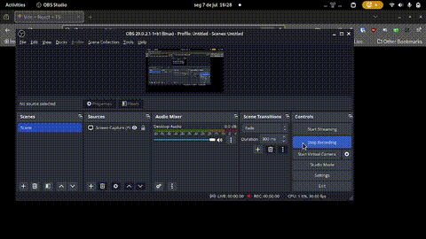

# URL Shortener v1

Welcome to URL Shortener v1! This is the first version of a simple and efficient URL shortening service built with React.

## 🚀 Description

This project is a frontend application that allows users to shorten long URLs into more manageable and shareable links. It's a great tool for anyone looking to simplify links for social media, emails, or any other platform where brevity is key.

## ✨ Features

*   **Shorten URLs:** Convert long URLs into short, easy-to-share links.
*   **Copy to Clipboard:** Easily copy the shortened URL with a single click.
*   **Responsive Design:** A clean and modern interface that works on all devices.

## 💻 Technologies Used

*   **React:** A JavaScript library for building user interfaces.
*   **TypeScript:** A typed superset of JavaScript that compiles to plain JavaScript.
*   **Vite:** A fast build tool and development server.
*   **shadcn/ui:** A collection of reusable UI components.
*   **Tailwind CSS:** A utility-first CSS framework for rapid UI development.

## ⚙️ Getting Started

To get a local copy up and running, follow these simple steps.

### Prerequisites

*   Node.js (v18 or higher)
*   npm or yarn

### Installation

1.  Clone the repo
    ```sh
    git clone https://github.com/your_username/url-shortener.git
    ```
2.  Install NPM packages
    ```sh
    npm install
    ```
3.  Run the development server
    ```sh
    npm run dev
    ```

## 🎬 Demo

Here is a short video demonstrating the application in action:



---

*This is the first version of this project. More features and improvements are coming soon!*